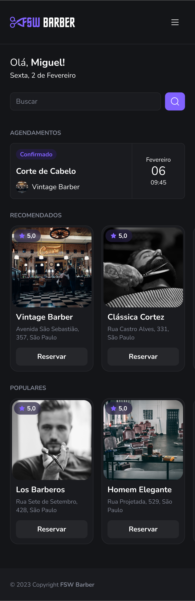
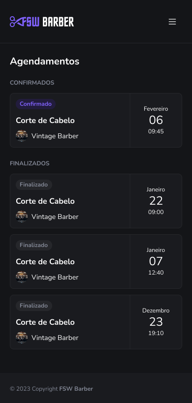

# FSW Barber
Encontre uma barbearia e agenda seus serviços

É possível se autenticar utilizando o Google (NextAuth) e buscar por diversas barbearias. Além de ver os serviços e agendar um horário. Projeto desenvolvido durante o evento Full Stack Week do Felipe Rocha.

Apenas o layout mobile está desenvolvido!
Layout desktop será desenvolvido em breve! Sinta-se à vontade para contribuir de qualquer maneira ao projeto.

Todas as barbearias e detalhes como preços e links das imagens são armazenadas em um banco de dados postgresql (Prisma).




## ✨ Tecnologias
- Next.js | TypeScript | TailwindCSS | Shadcn-ui | lucid-react | Prisma | date-fns | zod

## 🔖 Layout
Você pode visualizar o layout do projeto através [desse link](https://www.figma.com/file/N0KBLAxgXl9OVeWTGwS2OK/FSW-Barber-%5BLive%5D?type=design&node-id=1%3A6&mode=design&t=6hN4VdC5ieDlVoM5-1).

## 💻 Uso
Crie sua aplicação através do Github. Configure o seu banco de dados postgresql, adicione a url de conexão nas variáveis ambiente e execute a seed do banco. Preencha todas as variáveis ambientes em um arquivo chamado *.env*, siga a nomenclatura usada no arquivo de exemplo (*.env.example*), utilize também o Prisma para iniciar o seu banco. Lembrei se configurar a autenticação OAuth no Google Developer Console

Depois, em seu terminal:
```bash
# Clone o repositório
git clone https://github.com/ViGF/fsw-barber.git
# Acesse a pasta do projeto
cd fsw-barber
# Instale as dependências
npm i
# Execute a aplicação
npm dev
# Agora basta acessa-la
```
